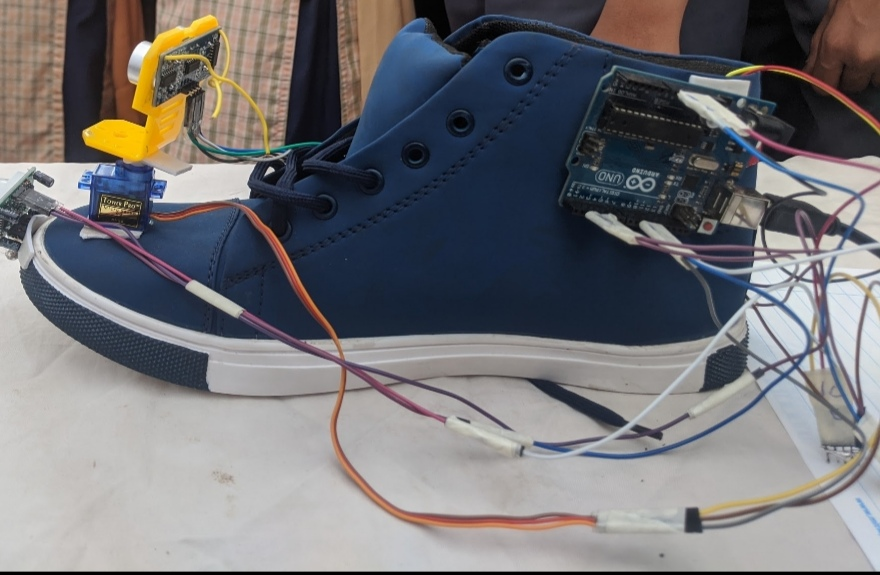

# Smart-wearables-for-visually-imapired-people

# Purpose - 

External factor dependency 
=> Due to lack or absence of visual sense, visually impaired people have to take help of other people or external sources for navigation in their own home as well as for carrying out day to day life tasks.

Blind Stick Issues 
=> The blind stick is unable to detect potholes leading to accidents.
=> The blind stick can't tell the user if there is an obstcle in which direction the user should move ahead.

One cap in which a camera is there can be used to detect around 80 objects using pretrained YOLO (You Only Look Once) object detection model trained on Microsoft COCO Dataset.

## Features - 

=> Obstacle detection 

=> Road crossing 

=> Location sender app 

=> Location saver app

=> Crowdie places alert 

=> Detects whether the obstacle is person or non living thing.

## Future scope -

Pothole detection 

## Technology Stack -

Java

Python

OpenCV

IoT

Deep learning 

To get the weights for yolo object detection model go to link https://drive.google.com/file/d/1yT2-zmNFymMgY42Z72LIuqMaiWvYEUQR/view?usp=sharing

